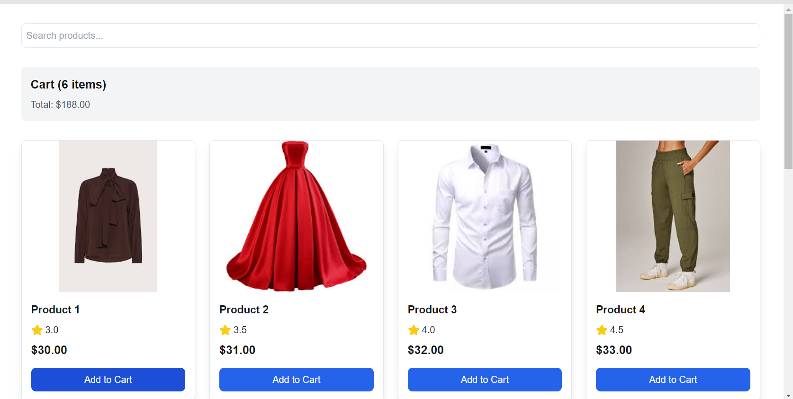

# E-commerce Product Listing Page

> **Project Context**: This is a demonstration application developed as part of a technical interview assessment, completed within a 2-hour timeframe. While it implements the core functionalities specified in the interview requirements, it is not intended to represent a full production application. The focus was on demonstrating technical capabilities, code quality, and implementation of specific features as per the interview instructions.

## Live Demo

**Live Application**: [https://ecommerce-product-listing-mu.vercel.app/](https://ecommerce-product-listing-mu.vercel.app/)

## Features

- Product List Display(image, price, name and rating)
- Search functionality: User should be able to search through the  product list
- Pagination/Infinite Scroll:  
- Add-to-cart button(local state management)

## Screenshots

## Tech Stack

- Next.js 13+ (App Router)
- TypeScript
- Tailwind CSS

## Prerequisites

- Node.js 16.x or higher
- npm or yarn package manager
- Git

## Installation

1. Clone the repository:
   ```bash
   git clone <your-repo-url>
   cd campaign-tracker/frontend
   ```

2. Install dependencies:
   ```bash
   npm install
   # or
   yarn install
   ```

3. Start the development server:
   ```bash
   npm run dev
   # or
   yarn dev
   ```

The application will be available at `http://localhost:3000`

## Project Structure

```
frontend/
├── app/                    # Next.js app router pages
├── components/            # Reusable UI components
├── lib/                   # Utility functions and hooks
│   ├── hooks/            # Custom React hooks
│   └── utils.ts         # Helper functions
├── public/               # Static assets
└── styles/              # Global styles
```

## Available Scripts

- `npm run dev`: Start development server
- `npm run build`: Build for production
- `npm run start`: Start production server
- `npm run lint`: Run ESLint

## Deployment

The frontend is deployed on Vercel. Any push to the main branch will trigger automatic deployment.